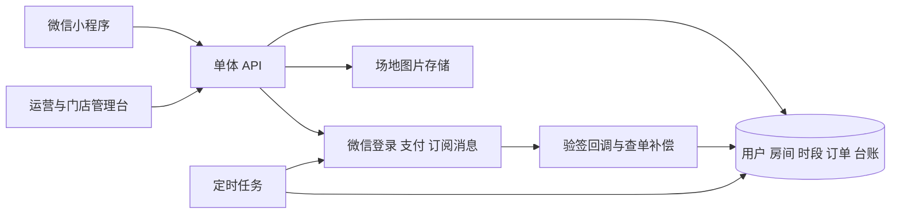

# 此刻 Space 小程序功能评审与分阶段开发建议

评审日期：2026 年 9 月 16 日。状态：供产品、运营、场地方和开发团队讨论，业务规则尚待确认。

## 1 结论与首版定位

建议先做「两处场地的录制预约工具 + 联盟活动展示 + 服务咨询入口」，跑通一笔真实订单的预约、支付、到店、结束、售后和场地方对账。六大业务都可以在界面上有所体现，但第一期只有场地预约进入自动交易流程，其余先由运营承接。

目前功能清单可以作为需求素材，**还不能直接作为固定报价和开发验收合同**：它混合了首期目标、远期平台能力、待确认问题和互相矛盾的运营规则。最需要补的是价格与退改口径、房间库存、预约运营后台、支付异常处理和验收标准。

先用本次提供的可点击 HTML 原型确认页面与流程。它是微信小程序的浏览器演示稿，使用内存模拟数据；不是可提交微信审核的小程序，不能真实支付、登录、扫码或发送通知。确认后再正式开发，避免把未确认规则固化在代码中。

### 依据与使用顺序

| 编号 | 输入文件 | 本次如何使用 |
|---|---|---|
| D1 | [小程序开发清单](./此刻Space播客联盟小程序开发清单.docx) | 功能范围的主要依据，尤其是 3.2「初期只实现播客商务合作活动发布，场地预定功能」 |
| D2 | [六大业务交付内容包](./此刻Space_六大业务交付内容包-0910.docx) | 服务目录、场地履约、后期制作、会员权益、商务合作背景 |
| D3 | [宣传页](./此刻Space_宣传页0717.docx) | 品牌语气、六大业务对外表达；不作为设备能力和价格的承诺依据 |
| D4 | [商业计划深度评审](./此刻%20Space%20商业计划深度评审与可执行改进方案.docx) | 采用其先试点、先验证付费闭环的思路；其中市场、法规、财务数据没有在本次逐条复核，不视为本项目经营事实 |

D1 与 D2 冲突时，原型暂按 D1 演示，但不代表已经获得业务批准。D4 提到的「3 点试点、上传下载、8—20 万元 MVP」也不能自动覆盖 D1 的两处场地、自备设备与初期范围。初次评审时仓库只有上述四份 Word，未见清单引用的场地 Excel、已有程序或接口。后续已按用户指定，将“一寸金​.jpg”和“栖源-茶空间.jpg”用于两处场地的原型展示。

## 2 开发前必须确认的业务问题

| 优先级 | 问题与来源 | 为什么影响开发 | 建议及当前原型口径 |
|---|---|---|---|
| P0 | D1 2.1：音频 60/视频 120 元每小时；D2 1.4：30/100 元 | 商品定价、展示、退款和结算均受影响 | 暂按 60/120 展示；开工前签定价表，按房间、录制类型、有效日期配置 |
| P0 | D1：新会员 29.8 元首 1 小时；D2：首次注册 29.8 元首 2 小时 | 「新人」是否须先付 98 元会员费、可用类型、超时价都不明确 | 原型仅在评审控制栏切换「新会员」资格，按音频首 1 小时 29.8、超出原价、不叠加 9 折演示；不是已上线权益 |
| P0 | D1：含茶饮，40 元给场地方，余款 30%/70% | 40 元是每人、每单还是每小时？折扣由谁承担？短单是否亏损？ | 必须确定茶饮份数、计价单位、退款分摊、优惠补贴方；原型茶饮内容显示待确认，未将结算公式投入使用 |
| P0 | D1 1.2：「场地方 / 联盟三方」只有两方，比例只有 30/70 | 第三方是谁、谁收款、谁开票、谁承担退款均不明 | 第一版先有可核对结算台账；收款主体与实际交易关系确认后选择支付产品，不能直接承诺自动分账 |
| P0 | D1 设备及 FAQ：自备录制和存储设备；D2 1.2/1.3/1.6：扫码开设备、自动录音云上传 | 两者对应完全不同的软件、硬件和文件管理成本 | 首期按自备手机/电脑/相机、自行保存；提供接口选择和试音检查，不开发录音、物联控制、文件云盘、一键分发 |
| P0 | D1：两处场地、大/小包间，具体信息见未提供的 Excel | 库存应到「房间」，同一场地不同房间可同时售卖 | 原型用两处文档命名场地、每处大小房各一间演示；房间存在性、容量、设备数、营业时间、照片、地址必须由运营补齐 |
| P0 | D1：半小时一格、3—7 天可选；FAQ 提前 3—5 天；D2 提前至少 7 天 | 预约窗口、最短提前时间、最短时长不是一回事 | 原型可选未来 7 天、30 分钟网格、最少 1 小时、最长 2 小时；均为演示假设；正式版还需设置清场缓冲及闭店时间 |
| P0 | D1：提前 24 小时可免费改期，24 小时内无空档取消扣 30% | 没有完整描述主动取消、迟到、爽约、门店取消、故障、已用部分 | 做单独退改矩阵；首期人工审核改期和退款，系统保留记录；不把一段 FAQ 当完整退款算法 |
| P0 | D1：退款 24h 内到账 | 商户受理、渠道处理、银行到账不是同一步 | 改为「受理后原路退款，可查看处理进度，到账以渠道结果为准」；不可保证统一 24 小时到账 [W2] |
| P0 | D1 1.1：多身份切换；会员也列为角色 | 用户切换界面不能获得场地或运营数据权限 | 会员是有生效/到期时间的权益；主播、品牌是业务资料；场地与运营权限由后台分配，并限定门店范围 |
| P1 | D1 1.3：6—10 分；2.1：5 星且强制评价离场；D2 1.8：1—5 分 | 指标无法比较，强制评价会挡住正常结束流程 | 统一可跳过的 1—5 星评价，低分进入工单；来源调查另设可选字段，不限制只能给高分 |
| P1 | D1：发布社交笔记/朋友圈、截图换 9 折 | 资格审核、重复领券、叠加和活动规则未定义 | 推迟到第二期；若做，人工审核截图、限领次数、有效期、适用 SKU；活动发布前核对平台当前规则 |
| P1 | D1：实名认证带问号；下单/签到都必填手机号 | 不应把微信登录、手机号授权、实名核验混成一次授权 | 浏览不登录；下单才补联系方式；普通预约暂不设证件采集，品牌/收款方所需材料按实际准入流程确认 |
| P1 | D1：24 小时前服务通知、客服 8—22 点与 15 分钟响应 | 依赖订阅授权、模板和真人排班；当日预约也可能不足 24 小时 | 通知按授权发送，失败可查；订单页始终可见；客服时间和响应承诺由运营确认 [W3] |
| P1 | D1：设备自检状态可视化 | 没有设备遥测接入，不能展示虚假的在线检测 | 首期做人工检查清单和报障工单，明确检查主体与时间，不显示「系统已检测正常」 |
| P1 | D1：充值、余额、自动续费；D2：98 元会员大量陪跑权益 | 引入储值账本、续费授权及持续履约责任；98 元不能默认覆盖无限人工 | 首期不做余额充值和自动续费。会员权益能稳定交付再开放手动付费；已有会员可由运营录入有来源的有效期 |
| P1 | D2 4.2/4.4/4.6：串台每季度/每月、活动另收费/基础免费 | 对会员的承诺不一致 | 统一次数、活动定价、名额、预约方式；首期会员页仅展示待确认权益和咨询入口 |
| P1 | D1 商务：电子签、开票、数据中台、AI 审核、自动提现 | 每项都依赖第三方准入或独立业务规则；全平台数据不能凭空采集 | 第一版只展示运营发布的公开合作活动和收集需求；后续按真实订单量逐项建设 |

### 茶饮结算需要单独拍板

仅为说明歧义，假定「40 元茶饮按每单固定计算，场地方先取茶饮，余款场地方 30%、联盟 70%，暂不扣支付手续费」：

| 实收金额 | 茶饮后余款 | 场地方所得 | 联盟所得 | 暴露的问题 |
|---|---:|---:|---:|---|
| 音频 1 小时 60 元 | 20 元 | 46 元 | 14 元 | 场地方占整单约 76.7%，并非 30% |
| 会员音频 54 元 | 14 元 | 44.2 元 | 9.8 元 | 优惠影响谁的收入，需要约定 |
| 体验单 29.8 元 | −10.2 元 | 不应套用此公式 | 不应套用此公式 | 实收低于茶饮固定额，必须确定补贴来源或套餐构成 |

微信普通商户分账需要开通权限并配置比例；官方文档说明默认最高比例为 30%。不能用「余款的 30%」代替「支付订单金额的分账比例」核验，也不能假定商户必然获批更高比例。[W1] 账本记录商业分配方案，与支付渠道实际划款要分开实现。人工对账不等于绕开支付准入；真实收款方案仍须匹配主体、合同和渠道要求。

## 3 功能清单如何分期

P0 是真实试营业必须具备；P1 是验证后投入；P2 是业务规模和外部接入满足后再做。原型中的演示能力不代表正式功能已经完成。

| 功能域 | P0 首期 | P1 第二期 | P2 暂缓 |
|---|---|---|---|
| 用户与权限 | 浏览免登录、下单登录和联系方式、基本资料、运营/门店授权、隐私说明与注销申请 | 品牌/主播资料及审核 | 对所有用户做统一证件认证 |
| 场地 | 列表、房间详情、图片、位置与手动选区、设备/人数说明、分享、营业日历 | 收藏、距离排序、组合筛选 | 多城市复杂调度 |
| 预约 | 连续时段、占用锁、报价、下单、支付、我的预约、签到、结束、取消/改期/退款工单 | 自助改期、续时补差、标准化异常补偿 | 无人值守硬件联动 |
| 支付与财务 | 预约单支付退款、回调、查单补偿、交易对账、结算台账和导出 | 审核通过后的渠道分账及回退 | 储值钱包、自由提现、多方复杂清结算 |
| 会员优惠 | 有明确权益时支持已有会员有效期及 9 折；首单规则确认才启用 | 98 元会员手动购买/续费、优惠券 | 自动续费、积分交易和复杂叠加 |
| 活动与商务 | 运营发布/下架合作活动、列表详情、感兴趣/咨询、联系人及需求收集、运营跟进 | 真实有需求再做报名人数、候补、核销、付费活动 | 品牌自助发单、智能匹配、主播购物车、签约和佣金平台 |
| 六大服务 | 六类服务介绍，后期/定制/孵化/资源互换/品牌合作用咨询承接 | 后期服务工单、人工报价、进度与交付记录 | 自动制作、节目分发、全平台数据抓取 |
| 评价与客服 | 自愿星级/文字评价、低分反馈、FAQ、人工联系、故障处理记录 | 图片评价、截图领券审核 | AI 客服、AI 内容审核、信用评级 |
| 文件与设备 | 自备设备提醒、接口选择、人工试音清单 | 独立验证文件上传、交付链接和保存期 | 自动开关设备、自动录音、私有云盘、媒体播放平台 |
| 消息与数据 | 授权后的预约通知、订单状态、发送结果记录、基础漏斗与导出 | 自动提醒重试、经营看板 | 全平台播放/粉丝/转化数据中台 |

**「活动发布」的首期定义**：由联盟运营发布审核过的公开活动，用户看详情并提交意向，运营联系确认。它不是品牌自由发商单的平台，也不是付费票务系统。若实际需要自动报名，需单独补人数库存、截止时间、名单、取消、核销和退款范围。

### 首期不能遗漏的运营后台

原清单的后台集中在商务撮合，反而缺少预约生意最基础的后台。建议交付一套 Web 管理台，至少覆盖：

1. 场地与房间：地址/图片、容量、支持模式、设备接口、营业时间、闭店/维修、清场缓冲、可预约窗口。
2. 排期与订单：按房间看日历；录入线下占用；查预约、补登记签到、结束、标记爽约。修改写明原因并留审计日志。
3. 售后：取消/改期、故障时长、补录、退款申请和审批；退款状态从渠道更新。
4. 交易和结算：订单、实收、优惠、茶饮、场地应付、退款调整、结算批次、异常单和导出。金额与规则版本可追溯。
5. 活动和线索：内容发布/下架、需求列表、负责人、联系记录和结果。
6. 配置和权限：价格及生效时间、会员有效期、退改说明、客服信息、账号/门店权限和操作日志。

场地方首期只需手机可用的「本站今日预约、核销、报障」页面及受限数据权限，不必完整做一个和用户端同等复杂的独立小程序。

## 4 原型结构与会前演示

入口：[打开原型文件](../prototype/index.html)。双击 HTML 可离线打开，也可按 [原型说明](../prototype/README.md) 启动本地预览。

底部导航采用「空间 / 活动 / 服务 / 我的」。会员中心放在我的；品牌需求从活动或服务进入；不让用户进来先选四种身份。

三种首页结构共用详情及预约流程：

| 方向 | 首屏结构 | 适用讨论 |
|---|---|---|
| A 空间优先，建议首版采用 | 品牌主视觉 + 场地卡片 + 预约入口 | 社群和场地扫码来的用户能否快速下单 |
| B 时间优先 | 先选择日期，再按时间列出空间 | 用户主要按「某天有空」来寻找场地时是否更快 |
| C 社区优先 | 编辑式活动封面 + 联盟故事 + 空间入口 | 更强调招募和社群品牌时，预约入口是否仍然清楚 |

推荐会议演示顺序（约 15 分钟）：

1. 三个首页各看一次，选主线；默认建议 A。三种不是三套独立产品。
2. 进入一寸金咖啡空间 → 小包间 → 音频 → 日期/时间/人数/接口 → 确认订单 → 模拟支付。
3. 对照普通用户、已有会员、新会员三种报价，确认折扣和茶饮口径。新会员资格仅为演示，未包含 98 元开通支付。
4. 模拟到店签到、试音检查、结束、可跳过评价；另下一单演示取消申请。
5. 查看活动与服务 → 提交演示咨询 → 切换运营预览，确认运营能看到线索与预约；模拟退款结果。
6. 在确认页演示支付失败/时段冲突，观察是否能返回重选；查看手机窄屏是否易用。

原型里的场地名取自 D1，场地照片采用用户指定图片；房间、时间库存、活动和容量配置仍是明确标注的示意。没有真实地图、活动报名、认证、支付、订阅通知和云上传。刷新会清空订单及线索。首次演示勿录入真实个人信息。

## 5 正式开发的技术拆分

### 技术形态

当前无既有代码或团队技术约束，建议先采用微信原生小程序配 TypeScript、一个 Web 运营台、一个模块化单体 API 服务和关系数据库。不要为两处场地拆微服务。后端语言在确认实施团队后确定：复用团队熟悉的 Java 或 TypeScript 体系即可，不应为原型另养一套生产栈。

图片进入对象存储；本期不存录音文件。支付、微信登录、订阅消息只从服务端对接，密钥不进入小程序或管理台。后台与小程序共用同一套订单/库存规则。云部署或云开发是否采用，先证明事务、库存并发、回调和对账可以完整实现，再比较维护成本。



### 核心数据和状态

| 对象 | 必须表达的信息 |
|---|---|
| User / Membership / RoleGrant | 微信标识与联系方式；会员生效/到期；独立的账号角色和门店授权范围 |
| Venue / Room / BusinessCalendar | 场地与房间分开、人数上限、设备数、模式、日期、营业/维修/缓冲 |
| SlotHold / Booking | 房间与连续时段、锁到期时间、人数、接口、状态、渠道、规则快照 |
| Quote / PriceSnapshot | 商品原价、优惠依据、实付、茶饮拆分、补贴方、规则版本和金额单位 |
| Payment / Refund | 商户单号、微信交易号、回调事件、金额、支付/退款状态、幂等标识 |
| CheckIn / ServiceIssue / Review | 核销人和时间、故障处理、结束、评价与运营跟进 |
| SettlementLedger | 场地应收、联盟收入、优惠承担、手续费、退款调整、批次和对账状态 |
| Activity / Lead | 内容与上下架；咨询意向、联系授权、负责人及跟进记录 |
| Notification / AuditLog | 通知授权与发送结果；谁在什么时候改了什么及原因 |

订单状态、支付状态和退款状态必须分开。建议的主流程：

```text
选时段 → 生成报价 → 事务占位 → 待支付
待支付 → 支付已确认 → 待到店 → 已签到/使用中 → 已结束
待支付 → 超时关单 → 释放占位
待到店 → 取消申请 → 审批确认取消 → 释放库存
取消单对应退款：待处理 → 处理中 → 成功 / 异常待处置
```

用户端「取消申请中」不等于「退款成功」，也不能立刻让原单继续签到。审批期间是否保留库存要制定规则；建议审批前仍保留、确认取消后释放，退款通过独立状态跟进。已用订单的部分退款不改变它的履约事实。

必须在实现中处理的边界：

- 用服务端时间、Asia/Shanghai 时区，金额以整数分存储。前端金额只供展示，服务端复算并保存快照。
- 连续半小时槽全量原子占用；同一房间同一时段只能有一份有效占用；下单前再次校验。可用数据库唯一键及事务，不依赖前端按钮置灰。
- 暂定 10 分钟支付占位（须确认）；到期关支付单并查单，支付成功与释放库存竞态要明确补偿路径，不能直接删占位。
- 微信回调验签、订单号和金额核对、幂等更新；客户端支付弹窗成功不是收款凭证。漏回调时主动查单。
- 支付超时后迟到的成功结果、重复支付、退款重试、分账回退、优惠券恢复都有独立处理记录；无法履约时进入人工处理与退款队列，不能超售。
- 改期要先取得新时段，再事务替换旧时段；新时段失败保持原预约。差价与优惠沿用/重算须有明确规则。
- 签到由门店工作人员核销；验证门店、订单状态和可核销时间，防止静态场地码被远程重复签到。原型不模拟真实核销鉴权。
- 用户只能读取自己的订单，门店只能读取授权房间的必要信息；财务和运营权限分开。角色切换不构成授权。
- 顾客拒绝定位、手机号授权、订阅通知时，提供手动选区、联系方式处理路径和订单页查询，不让失败悄悄吞掉订单。

## 6 建议的工作包和开发顺序

以下为工程规划估算，不是报价或承诺。假设 1 名前端（兼小程序和管理台）、1 名后端、产品/运营参与决策，测试人员阶段参与；不含硬件集成、备案/类目/商户号申请和微信审核等待时间。

| 阶段 | 输出与范围 | 建议投入/日历 | 进入下一阶段的条件 |
|---|---|---|---|
| 第 0 阶段 原型与规则确认 | 本次评审及演示原型；补场地表，选首页，确认价格/退改/收款方案 | 约 2—4 个工作日用于会议和修改 | 产品、运营、场地方确认 P0 规则；明确收款主体与商户接入可行性 |
| 第 1 阶段 真实预约 MVP | 下面 6 个工作包；用户端与运营台同步完成 | 约 32—47 人日，按双开发交错排期约 4—6 周 | 真机支付退款、并发占位、权限与运营全链路验收通过 |
| 第 2 阶段 两场地试营业 | 小范围真实预约、人工对账、记录故障/取消/复购/咨询 | 2—4 周运营观察，不等于全时开发 | 无未解决的重复售卖、资金或权限问题；双方每日可核对账单 |
| 第 3 阶段 按证据补功能 | 高频改期自动化、会员付费、券、后期工单、活动报名 | 每个迭代约 1—2 周；重新按选定需求估算 | 确实减少人工或提升成交，规则已稳定 |
| 第 4 阶段 商务平台化 | 主播档案、合同、分账、数据接入、智能匹配按项目建设 | 不与首期捆绑报价 | 已有持续成交及标准交付，数据授权/渠道和接口明确 |

一位全栈独立实施同样范围，按约 32—47 开发工作日加业务反馈，日历可先预留 7—10 周；不要把双人估算直接套给单人。方案变更及第三方接入问题需另留缓冲。D4 的 8—20 万元范围包含不同假设，不能作为这里的实施报价。

| 工作包 | 交付内容 | 估算人日 | 依赖与验收样例 |
|---|---|---:|---|
| W01 基础与资源 | 登录、权限、场地房间 CRUD、营业及闭店日历 | 5—7 | 场地资料到齐；门店 A 无法查询门店 B 私有订单 |
| W02 可预约报价 | 用户列表/详情、连续时段、人数/模式校验、规则快照 | 6—8 | 价格口径确认；跨营业边界和超容量不可下单 |
| W03 下单与支付 | 占位、超时关单、微信支付、回调、查单补偿 | 6—9 | 商户号可用；两客户端抢同一房间同一时段仅一个订单成立 |
| W04 履约与售后 | 我的预约、核销、结束、报障、改期/取消工单、退款 | 6—9 | 退改矩阵确认；重复回调/退款请求不产生重复资金动作 |
| W05 活动与经营 | 活动发布、服务介绍、咨询线索、基础台账和通知 | 4—6 | 运营能发布后下架并查看跟进；已退款款项反映到结算调整 |
| W06 联调与试营业 | 真机、权限、并发、支付异常、备份恢复、发布材料与培训 | 5—8 | 真实小额交易及退款核对完成，运营能独立处理一笔正常单和异常单 |
| 合计 | 在 P0 范围和规则稳定前提下 | 32—47 | 小程序审核时间另计 |

最先写的是场地/时段/订单状态和后台，随后把真实支付接入一条可用路径；不要把所有页面画完才开始验证支付和库存。

## 7 试营业验收及经营观测

### 真实上线验收

| 场景 | 验收结果 |
|---|---|
| 同房间并发预约 | 不能产生两个已付款且需履约的冲突预约；跨房间正常并行 |
| 长时段跨越占用或闭店 | 整段不可售，不能只检查开始时间 |
| 支付取消、失败、超时、重复回调 | 不误标成功、不重复扣库存；到期安全释放；账实一致 |
| 普通价、会员、首单、优惠过期 | 服务端金额与已确认规则一致；展示与收款一致；分摊可追溯 |
| 改期冲突 | 原订单与原时段仍然有效；不出现「新时段失败，旧时段也没了」 |
| 取消与退款异常 | 用户看得到进度；渠道退款失败进入处理队列；已结算订单有冲正记录 |
| 设备故障与门店取消 | 运营可登记原因、补录/退款并通知用户；受影响库存及时封闭 |
| 定位或订阅被拒绝 | 能手动找场地、看预约；不影响已成功订单 |
| 权限与核销 | 用户不能看他人订单；场地越权被拒；重复核销无副作用 |
| 真实运营 | 门店能看到准确排期；活动下架生效；咨询有人负责；每日账单一致 |

### 首批经营指标

优先记录「场地详情→选择时段→确认→支付→到店→完成→再次预约」；记录事件对应的订单/房间/时间及来源。评价和咨询是独立事件，不强制用户填写。不要把开发期间的模拟流量计入真实转化。

每日看支付订单、退款异常、房间可售与已售时长、故障；每周看同批用户复购、后期咨询转成交、线索跟进结果及订单贡献。单笔贡献至少分开记录实收、退款、场地/茶饮、支付手续费、直接人工及补贴，不用营业额代替利润。

不要照搬 D4 的利用率、复购率和利润阈值当既定 KPI。先积累两处场地的数据，运营与场地方共同设定继续投入的阈值。

## 8 确认会议的决策单

| 待确认事项 | 建议起点 | 确认结果与负责人 |
|---|---|---|
| 首期范围 | 预约交易 + 运营发布活动 + 服务咨询；不做完整商务交易 | 待填写 |
| 首页方向 | A 空间优先；B/C 用于比较 | 待填写 |
| 两处场地/房间资料 | 补 Excel、实景照片、位置、容量、设备、营业与清场时间 | 待填写 |
| 售价与茶饮 | 音频 60 / 视频 120 暂定；明确 40 元的单位和包含份数 | 待填写 |
| 首单及会员 | 新会员是否先买 98 元、首单适用类型、折扣叠加、权益和到期 | 待填写 |
| 支付和结算主体 | 谁收款开票、谁签合同、退款承担及分成结算周期 | 待填写 |
| 退改与异常 | 取消、改期、迟到、爽约、故障、门店取消逐项定规则 | 待填写 |
| 录音交付边界 | 首期顾客自备设备、自行保存，现场有试音与使用说明 | 待填写 |
| 活动含义 | 先展示与咨询；是否确实需要付费报名另行决定 | 待填写 |
| 人员和接入准备 | 产品拍板人、场地对接人、客服排班、开发团队、微信主体与商户号 | 待填写 |

会议结束至少产出：一张已确认的价格表、一张退改矩阵、一张房间资源表、一份首期范围和负责人名单。明确哪些决定仍未达成，不把「原型看起来可以」误当所有规则获批。

## 9 平台核验参考

本次仅核对与首期范围直接有关的支付和通知能力；未确认本项目实际商户资质、类目与权限。正式接入按当时官方文档及账号后台为准。

- W1 [微信支付普通商户分账产品介绍](https://pay.wechatpay.cn/doc/v3/merchant/4012067962)及[分账常见问题](https://pay.wechatpay.cn/doc/v3/merchant/4014547102)：接收方、开通权限、订单分账上限及退款后的资金处理需单独设计。
- W2 [微信支付订单退款开发指引](https://pay.wechatpay.cn/doc/v3/partner/4013080623)：区分申请、处理中、异常与成功；官方说明到账有延迟，不能统一承诺 24 小时到账。
- W3 [腾讯云开发订阅消息接入说明](https://docs.cloudbase.net/en/recipes/add-subscribe-message-cloud-function)：由用户操作触发订阅授权，再由服务端发送；模板与实际类目需在微信后台验证。本次微信开发文档原页抓取失败，采用腾讯云开发官方说明，不据此假定本项目已获得模板。

核验日期同评审日期。D4 中有关政策、市场和融资的表述没有用于推导本次工期或形成法律结论。
